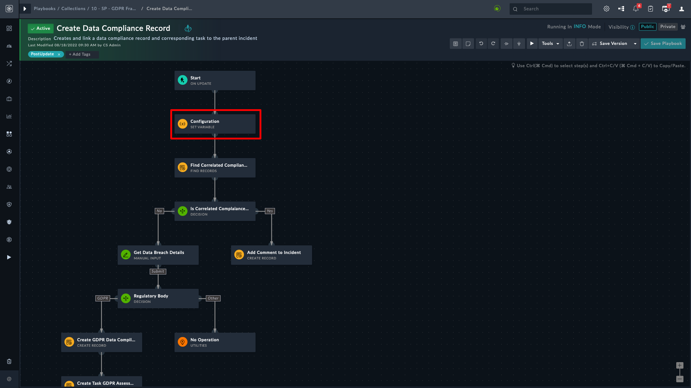
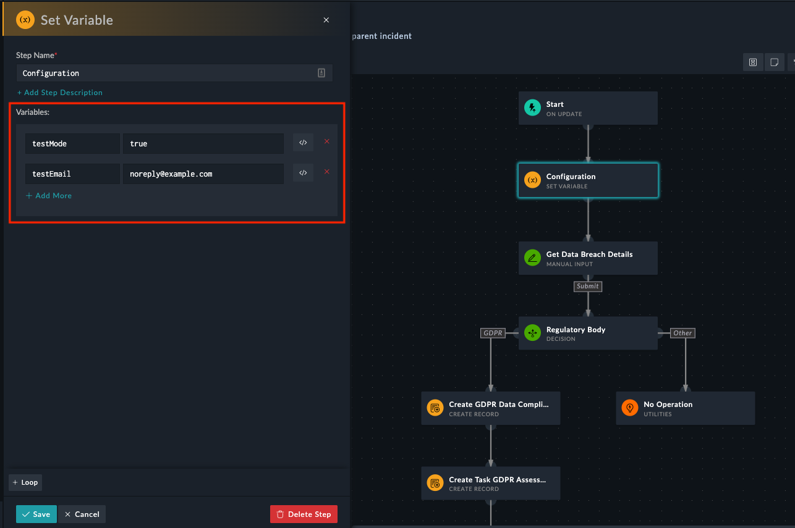
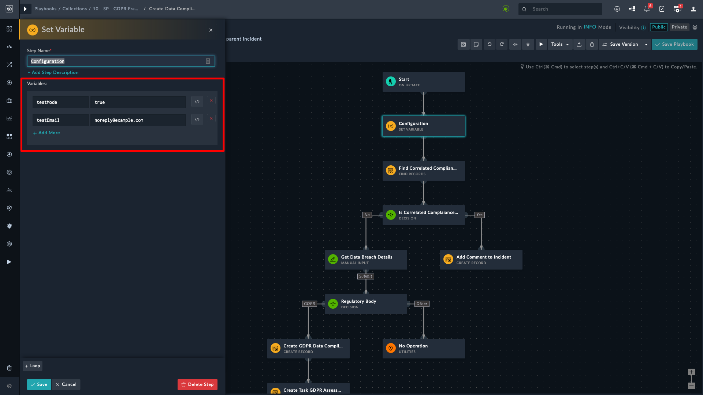
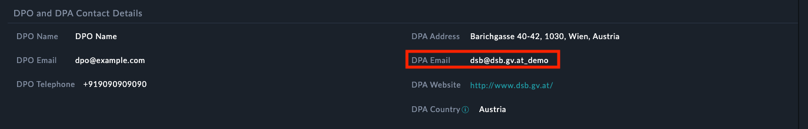
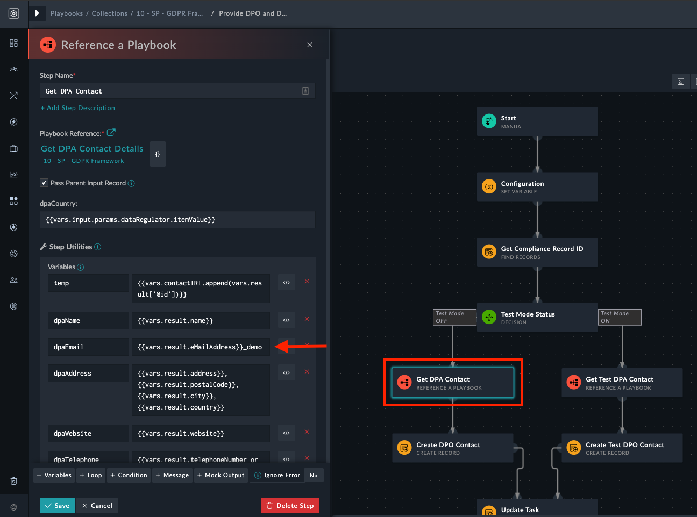
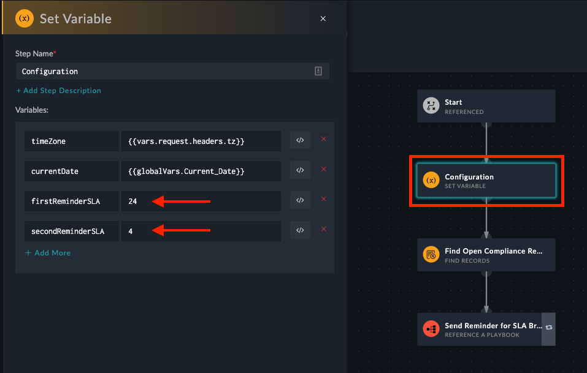

| [Home](../README.md) | 
|----------------------| 
 
# Installation 
1. To install a solution pack, click **Content Hub** > **Discover**.
2. From the list of solution packs that appear, search for **GDPR Framework**.
3. Click the **GDPR Framework** solution pack card.
4. Click the **Install** button on the lower part of the screen to begin the installation.

## Prerequisites

The **GDPR Framework** solution pack depends on the following solution packs.

| Solution Pack Name | version | Purpose                                                                                                                                                                                           |
|:-------------------|:--------|---------------------------------------------------------------------------------------------------------------------------------------------------------------------------------------------------|
| SOAR Framework     | v2.0.0  | <ol><li>Required for Incident Response modules and Action playbooks</li><li>Required for "Was personal data affected?" field which acts as a trigger point for GDPR Framework Playbooks</li></ol> |

If you have already installed the GDPR solution pack v1.0.0, remove the following fields and picklists from the **Incident** Module:

### Fields
- Breach Detection Date 
- Breach Occurrence Date 
- Breach Notify Due Date 
- Breach Paused Date 
- Breach Notification SLA(Picklist - SLAState)
- Was the data encrypted? (Picklist - YesNo Picklist)
- Was the exposure resolved? (Picklist - YesNo Picklist)
- Is harm, risk, or misuse foreseeable? (Picklist - YesNo Picklist)
- What was the data format? 
- What was the data source? 
- Company Name 
- Company Size 
- Company City
- Company Country 
- Cause of Data Breach 
- Type of Data Breach (Picklist - `DataBreachType`)
- Data Type 
- Where data was hosted?
- Repercussions of Breach
- Mitigation Actions
- No. of Affected Users 
- No. of Affected Data Records 
- Affected Users' Emails
- Any Additional Information
- Data Regulator (Picklist - `GDPREUCountryList`)
- DPA Website
- DPA Email
- DPA Address
- DPO Telephone
- DPO Email
- DPO Name
- Summary of DPO Advice
- Is Valid Breach? (Picklist - `YesNo`)
- Is DPIA Required?
- Reason To Perform DPIA
- Impact Severity on Affected Users (Picklist - `Severity`)
- Measures to Reduce Future Risks

### Picklists
- `DataBreachType`
- `YesNo`

# Configuration 
For optimal performance of **GDPR Framework** solution pack, configure **Code Snippet** connector to extract and build an address book of geo-specific Data Protection Authority (DPA) contacts.

- To configure **Code Snippet** connector, refer to [Configuring Code Snippet](https://docs.fortinet.com/fortisoar/connectors/codesnippet) connector document.

<table>
    <tr>
        <td><strong>NOTE</strong></td>
        <td>The connector comes pre-installed and hence needs only configurations.</td>
    </tr>
</table>

## Playbook Execution Modes

You can execute the GDPR playbooks in *Test Mode* as well as in *Production Mode*

- The playbooks are by default configured to execute in *Test Mode*
  - The *Test Mode* uses a test email address for all email communication towards Data Protection Officer (DPO), affected individuals, or Data Protection Authority(DPA)
  - The *Production Mode* uses the actual email addresses of relevant authorities and stakeholders

<table>
    <tr>
        <td><strong>WARNING</strong></td>
        <td>Please be careful of the email addresses you use, as data breach notification emails are sent to these addresses. Hence, while in <strong>Test</strong> mode, do not use actual DPO and DPA email addresses.</td>
    </tr>
</table>

### Test Mode

To change the execution mode to *Test* make the following changes:

1. Go to the *Create Data Compliance Record* playbook under the **10 - SP - GDPR Framework** collection and open the *Configuration* step

    

2. Modify the value of the `testMode` variable to `true`.
3. Change the value of the `testEmail` variable to a valid email address capable of receiving all GDPR email notifications.

    <table>
        <tr>
            <td><strong>WARNING</strong></td>
            <td>When in <strong>Test</strong> mode, the value of the <code>testEmail</code> variable must not be empty.</td>
        </tr>
    </table>

    

### Production Mode

To change the execution mode to *Production* make the following changes:

1. Go to the *Create Data Compliance Record* playbook under the **10 - SP - GDPR Framework** collection and open the *Configuration* step

    

2. Modify the value of the `testMode` variable to `false`.
3. Keep the `testEmail` variable blank.

    

    <table>
        <tr>
            <td><strong>NOTE</strong></td>
            <td>As a failsafe, <code>_demo</code> is appended to DPA's email as shown in the following image. This action prevents any accidental sending of mail to the Data Protection Authority (DPA).</td>
        </tr>
    </table>

    

In *Production* mode before you execute **Provide DPO and DPA Contact** playbook, make the following changes:
1. Go to **Provide DPO and DPA Contact** playbook.
2. Open the *Get DPA Contact* step and remove `_demo` from `dpaEmail` variable as shown.
    

## Check for SLA Violation Playbook

This playbook sends progressive SLA breach reminder emails. To set threshold values for reminder notifications, make the following configuration changes:

1. Goto **Check for SLA violation** Playbook and open the *Configuration* step.
2. The reminder threshold value is in hours. Change values of the following variables
    - `firstReminderSLA`: The default value is 24 Hours which means the first reminder is sent when the SLA time remaining is less than 24 hours left.
    - `secondReminderSLA`: The default value is 4 Hours which means the second reminder is sent when the SLA time remaining is less than 4 hours left.
        

A third and final reminder, of SLA breach, is sent after the completion of 72 hours.

| [Usage](./usage.md) | [Contents](./contents.md) |
|---------------------|---------------------------|