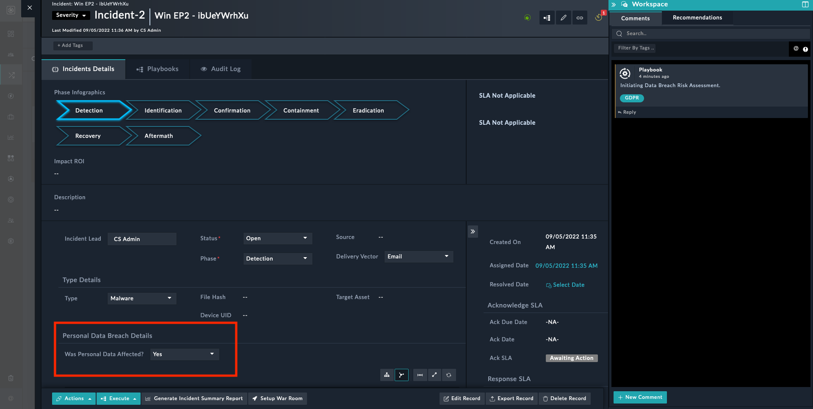
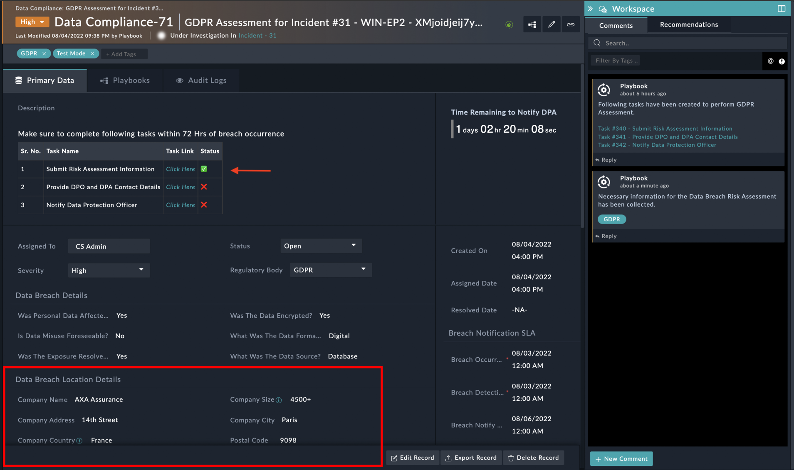
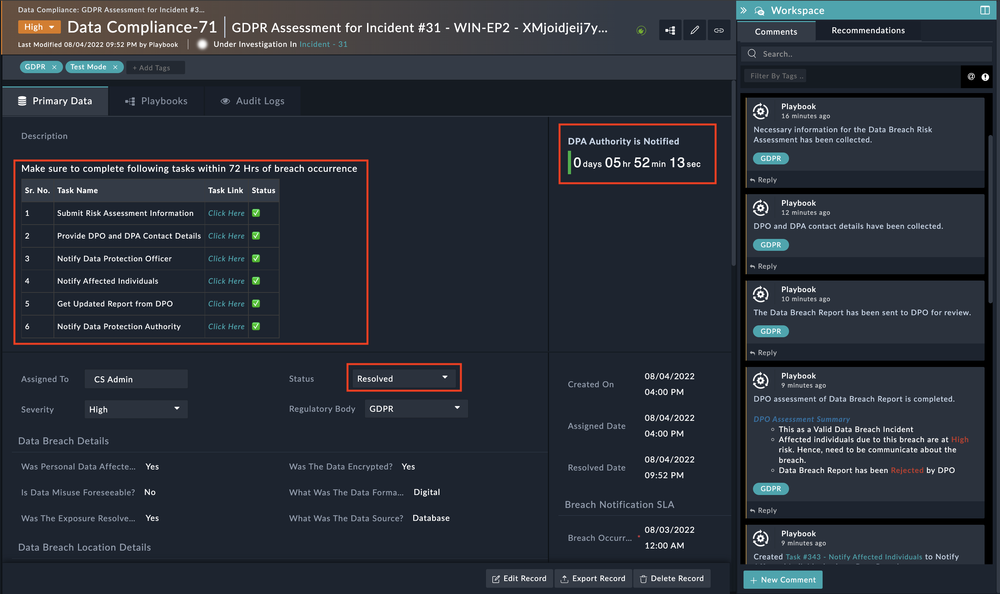

| [Home](https://github.com/fortinet-fortisoar/solution-pack-gdpr-framework/blob/release/1.0.1/README.md) | 
|--------------------------------------------| 

# Usage

## Gathering Details on Personal Data Breach

- When a personal data breach is detected in an incident, choose the value of the **Was Personal Data Affected?** field as **Yes**.

    

- A pop-up appears that collects additional information related to the incident

    

- Choose 'Demo Mode Status' as "Demo Mode On" to execute GDPR playbooks in demo mode. Also, add 'Demo Email' to which all email communications will be sent.

- Select 'GDPR' in 'Regulatory Body' and provide the needed information

    

- A New Data Compliance Record, dedicated to GDPR Assessment and the corresponding task is created. The same is updated in the Incident comments.

    

- **GDPR Assessment Data Compliance Record**
  - Open the newly created GDPR Data Compliance Record; the corresponding tasks appear in the Description field and the task tabs. The tasks need to be completed within 72 Hours

  - The Data Compliance Record is also updated with additional details and starts showing up the remaining time to Notify Supervisory Authority.

    

## Tasks

- **Get GDPR Risk Assessment Information**
  - Open the `Get GDPR Risk Assessment Information` Task and click on **"GDPR Risk Assessment Form"** Button

    

  - Fill up the Risk Assessment details in the pop-up

    

  - Once the task is complete, it is highlighted in GREEN and the status is marked as **Complete**

    

- **Get DPO and DPA Contact**
  - Similarly, Collect DPO and DPA contact details under **Provide DPO and DPA Contact Details Task**

    

  - Details provided reflect in the created incident as shown, and the task is marked as complete

    

- **Review and Approve Breach Report by DPO**
  - Open the `Review and Approve Breach Report by DPO` Task and click on the 'Notify Data Protection Officer' Button to get the information reviewed and approve the report to send to Data Protection Authorities

    
  
Based on the inputs from DPO, the following new task is created

- **Communicate Affected Users of Breach**
  - If affected individuals are at **High** or **Medium** Risk, this new task is created to notify the individual of a data breach
  - Open the task and click on the `Notify Affected User` button
  - The notification should contain the following information
    - What happened? - Provide brief information on data breach
    - What Information Was Involved? - Provide information on what type of data was compromised
    - What Are We Doing? - Provide remediation/mitigation action are taken or planned to be taken
    - What You Can Do? - Provide advisory to the user about actions to be taken to minimize the risk

    

- **Get Updated Report from DPO**
  - If DPO rejects the data breach report, then this new task is created where the DPO can update the Data Breach Report and submit a new data
  - Open the task and click on the `Get Updated Breach Report` button

- **Notify Data Protection Authority**
  - This new task is created to Notify DPA of a data breach.
  - Open the task and click on the **Send Data Breach Report to DPA** Button
  - This task generates the following report and sends it to the DPA and resolves the GDPR Assessment Incident

  

   
