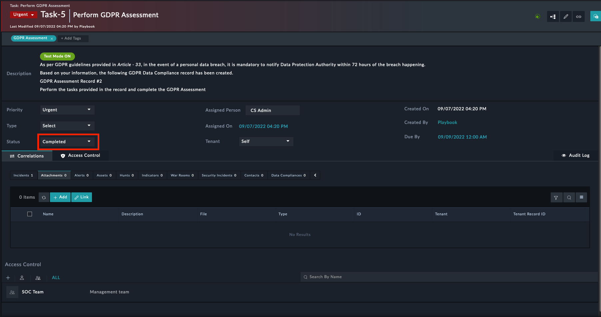

| [Home](../README.md) |
|----------------------|

# Usage

<table>
    <tr>
        <td><strong>WARNING</strong></td>
        <td>If you have HIPAA Framework Solution Pack already installed in your system, ensure to deactivate the <strong>Create Data Compliance Record</strong> under the <em>10 - SP - GDPR Framework</em> playbook collection.</td>
    </tr>
</table>

## Gathering Details on Personal Data Breach

1. When a personal data breach is detected in an incident, choose the value of the **Was Personal Data Affected?** field as **Yes**.

    

2. A pop-up appears that collects additional information related to the incident

    <table>
        <tr>
            <td><strong>NOTE</strong></td>
            <td>
When playbooks are executed in <em>Test</em> mode, the <strong>Green</strong> icon shown in the following screenshot appears in all the tasks related to this solution pack

                

                
Similarly, when playbooks are executed in *Production* mode, a <strong>Red</strong> icon shown in the following screenshot appears

                

            </td>
        </tr>
    </table>

3. Select **GDPR** in **Regulatory Body** and provide the required information

    

4. A New Data Compliance Record, dedicated to GDPR Assessment and the corresponding task, is created. The same is updated in the Incident comments.

    

### GDPR Assessment Data Compliance Record

- Open the newly created GDPR Data Compliance Record; the corresponding tasks appear in the Description field and the task tabs. The tasks need to be completed within 72 Hours.

- The Data Compliance Record is also updated with additional details and starts showing up the remaining time to notify the supervisory authority.

    

## Submit Risk Assessment Information

1. Open the **Submit Risk Assessment Information** Task and click the **Submit Risk Assessment Information** button.

    

2. Enter the Risk Assessment details in the pop-up that appears.

    

3. Details provided by DPO are reflected in the created data compliance record as shown, and the task is marked as complete.

    

## Provide DPO and DPA Contact Details

1. Open the **Provide DPO and DPA Contact Details** Task and click the **Provide DPO and DPA Contact Details** button.

2. Similarly, Collect DPO and DPA contact details under **Provide DPO and DPA Contact Details** Task

    

3. Details provided reflect in the created data compliance record as shown, and the task is marked as complete

    

## Notify Data Protection Officer

1. Open the **Notify Data Protection Officer** task and click the **Notify Data Protection Officer** button. This sends an email to the DPO.

2. The DPO clicks the link in the email to review and approve the information shown in the following screen.

    
  
3. Details provided by DPO is reflected in the created data compliance record as shown, and the task is marked as complete

    

Based on the inputs from DPO, new tasks may be created. Following flow diagram explains when a new task is created:

## Get Updated Report from DPO

If DPO rejects the data breach report, then this new task is created where the DPO can update the Data Breach Report and submit new data.

1. Open the task and click the **Get Updated Breach Report** button.
2. The process now is the same as described in [Notify Data Protection Officer](#notify-data-protection-officer) section.

## Notify Affected Users

1. Open the task and click the **Notify Affected Individuals** button
2. The notification should contain the following information
    - What happened? - Provide brief information on data breach
    - What Information Was Involved? - Provide information on what type of data was compromised
    - What Are We Doing? - Provide remediation/mitigation action are taken or planned to be taken
    - What You Can Do? - Provide advisory to the user about actions to be taken to minimize the risk

        

## Notify Data Protection Authority (DPA)

This new task is created to Notify DPA of a data breach.

1. Open the task and click the **Send Data Breach Report to DPA** Button.
2. This task performs the following actions:
    - Generates the following report and sends it to the DPA
    - Resolves the GDPR Compliance record
    - Completes the task **Perform GDPR Assessment** associated with the parent incident

    

     

    

| [Installation](./setup.md#installation) | [Configuration](./setup.md#configuration) | [Contents](./contents.md) |
|-----------------------------------------|-------------------------------------------|---------------------------|